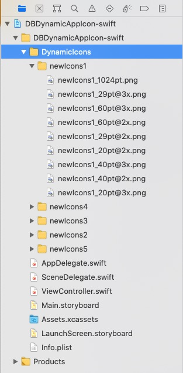
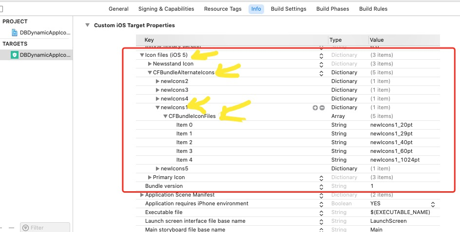

# DBDynamicAppIcon
动态改变APP图标，目前有oc版和swift版

动态修改app的图标，就是在不重新安装app的情况下，可以修改当前的icon图标；在某些情况下，是有这个需求的；例如，可以更换主题的app中，一般都会有一套完整的主题包含相应的icon；还有就是一些节日主题的icon或者促销的icon，例如淘宝、京东等的节日icon。

在iOS 10.3之后，苹果官方提供了相关的API来实现这个功能，主要是下面这几个方法：

``` objective-c
@interface UIApplication (UIAlternateApplicationIcons)
// 如果为NO，表示当前进程不支持替换图标
@property (readonly, nonatomic) BOOL supportsAlternateIcons NS_EXTENSION_UNAVAILABLE("Extensions may not have alternate icons") API_AVAILABLE(ios(10.3), tvos(10.2));

// 传入nil代表使用主图标. 完成后的操作将会在任意的后台队列中异步执行; 如果需要更改UI，请确保在主队列中执行.
- (void)setAlternateIconName:(nullable NSString *)alternateIconName completionHandler:(nullable void (^)(NSError *_Nullable error))completionHandler NS_EXTENSION_UNAVAILABLE("Extensions may not have alternate icons") API_AVAILABLE(ios(10.3), tvos(10.2));

// 如果alternateIconName为nil，则代表当前使用的是主图标.
@property (nullable, readonly, nonatomic) NSString *alternateIconName NS_EXTENSION_UNAVAILABLE("Extensions may not have alternate icons") API_AVAILABLE(ios(10.3), tvos(10.2));
@end
```

- 一. 配置icon
添加图片icon
动态修改的icon不能放在 Assets.xcassets 里，但是正常的主icon还是可以在这里设置的，也可以按下面的方法来设置；
首先，把需要修改的icon放在一个文件夹内：




-  二.配置info.plist

  在info.plist中右键 -> Add Row ：
  输入Icon... 会有提示，选择Icon files（iOS 5）

  


- 三.写代码请下载demon

``` swift
    func changeAppIconWithName(_ iconName:String) -> Void {
        if !UIApplication.shared.supportsAlternateIcons {
            return
        }
        UIApplication.shared.setAlternateIconName(iconName) { (error) in
            if (error != nil) {
                print("更换app图标发生错误\n")
                print(error as Any)
            }else{
                print("已经完成了app图标的更换")
            }
        }
    }
```

``` objective-c
- (void)changeAppIconWithName:(NSString *)iconName {
    if (![[UIApplication sharedApplication] supportsAlternateIcons]) {
        return;
    }
    
    if ([iconName isEqualToString:@""]) {
        iconName = nil;
    }
    [[UIApplication sharedApplication] setAlternateIconName:iconName completionHandler:^(NSError * _Nullable error) {
        if (error) {
            NSLog(@"更换app图标发生错误了 ： %@",error);
        }else{
            NSLog(@"已经完成了app图标的更换");
        }
    }];
}
```